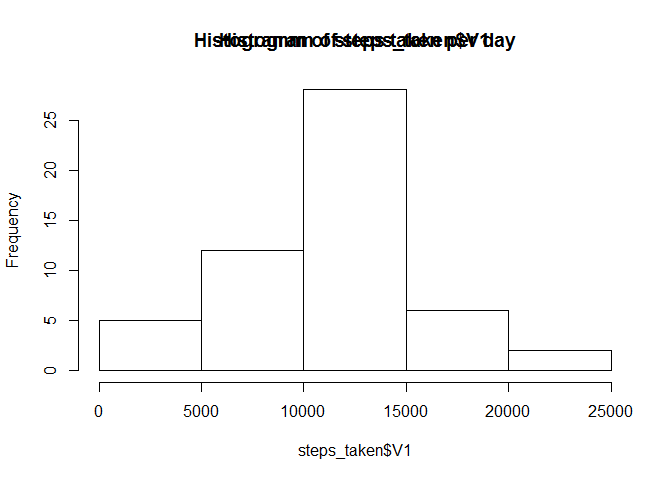
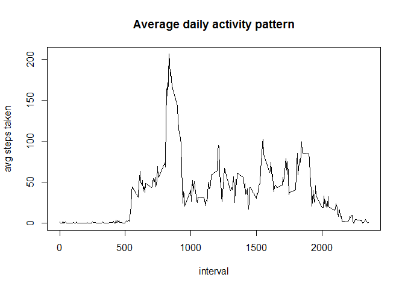
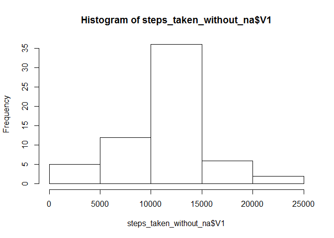
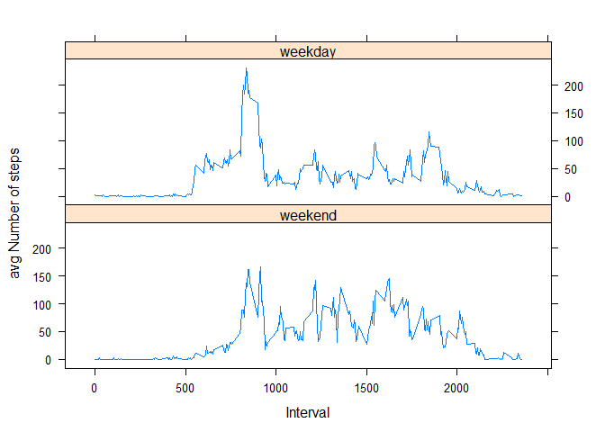

# Reproducible Research: Peer Assessment 1


## Loading and preprocessing the data


```r
#loading the data
setwd("~/GitHub/RepData_PeerAssessment1")
activity_data <- read.csv(file = unz("activity.zip", "activity.csv"), stringsAsFactors = FALSE)


library(dplyr)
```

```
## 
## Attaching package: 'dplyr'
## 
## Die folgenden Objekte sind maskiert von 'package:stats':
## 
##     filter, lag
## 
## Die folgenden Objekte sind maskiert von 'package:base':
## 
##     intersect, setdiff, setequal, union
```

```r
#add column with full timestamp
activity_data <- mutate(activity_data, timestamp = as.POSIXlt(date) + (60 * interval))
```

## What is mean total number of steps taken per day?


```r
library(data.table)
```

```
## 
## Attaching package: 'data.table'
## 
## Die folgenden Objekte sind maskiert von 'package:dplyr':
## 
##     between, last
```

```r
DT <- data.table(activity_data)
steps_taken <- DT[,sum(steps), by = date]
steps_taken
```

```
##           date    V1
##  1: 2012-10-01    NA
##  2: 2012-10-02   126
##  3: 2012-10-03 11352
##  4: 2012-10-04 12116
##  5: 2012-10-05 13294
##  6: 2012-10-06 15420
##  7: 2012-10-07 11015
##  8: 2012-10-08    NA
##  9: 2012-10-09 12811
## 10: 2012-10-10  9900
## 11: 2012-10-11 10304
## 12: 2012-10-12 17382
## 13: 2012-10-13 12426
## 14: 2012-10-14 15098
## 15: 2012-10-15 10139
## 16: 2012-10-16 15084
## 17: 2012-10-17 13452
## 18: 2012-10-18 10056
## 19: 2012-10-19 11829
## 20: 2012-10-20 10395
## 21: 2012-10-21  8821
## 22: 2012-10-22 13460
## 23: 2012-10-23  8918
## 24: 2012-10-24  8355
## 25: 2012-10-25  2492
## 26: 2012-10-26  6778
## 27: 2012-10-27 10119
## 28: 2012-10-28 11458
## 29: 2012-10-29  5018
## 30: 2012-10-30  9819
## 31: 2012-10-31 15414
## 32: 2012-11-01    NA
## 33: 2012-11-02 10600
## 34: 2012-11-03 10571
## 35: 2012-11-04    NA
## 36: 2012-11-05 10439
## 37: 2012-11-06  8334
## 38: 2012-11-07 12883
## 39: 2012-11-08  3219
## 40: 2012-11-09    NA
## 41: 2012-11-10    NA
## 42: 2012-11-11 12608
## 43: 2012-11-12 10765
## 44: 2012-11-13  7336
## 45: 2012-11-14    NA
## 46: 2012-11-15    41
## 47: 2012-11-16  5441
## 48: 2012-11-17 14339
## 49: 2012-11-18 15110
## 50: 2012-11-19  8841
## 51: 2012-11-20  4472
## 52: 2012-11-21 12787
## 53: 2012-11-22 20427
## 54: 2012-11-23 21194
## 55: 2012-11-24 14478
## 56: 2012-11-25 11834
## 57: 2012-11-26 11162
## 58: 2012-11-27 13646
## 59: 2012-11-28 10183
## 60: 2012-11-29  7047
## 61: 2012-11-30    NA
##           date    V1
```

```r
hist(steps_taken$V1)
title("Histogramm of steps taken per day")
```

 

```r
# mean steps
mean_steps <- mean(na.omit(steps_taken$V1))
# median steps
median_steps <- median(na.omit(steps_taken$V1))
```
The mean of total number of steps per day is: 1.0766189\times 10^{4}  
The median of total numer of steps per day is : 10765

## What is the average daily activity pattern?


```r
avg_steps_taken <- DT[,mean(na.omit(steps)), by = interval]
plot(avg_steps_taken$interval, avg_steps_taken$V1, type = "l", xlab = "interval", ylab = "avg steps taken")
title("Average daily activity pattern")
```

 

```r
avg_steps_taken[max(avg_steps_taken$V1),]$interval
```

```
## [1] 1705
```

## Imputing missing values


```r
nrow(activity_data[is.na(activity_data$steps),])
```

```
## [1] 2304
```


```r
fill_missing_values <- function(activity_data){
        activity_data_without_na <- activity_data
        for(i in 1:nrow(activity_data)){
                if(is.na(activity_data[i,]$steps)){
                        activity_data_without_na[i,]$steps = 
                                round(avg_steps_taken[avg_steps_taken$interval == activity_data[i,]$interval,]$V1)
                }
        }
        activity_data_without_na
}
```


```r
activity_data_without_missing_values <- fill_missing_values(activity_data)
```


```r
DT_without_na <- data.table(activity_data_without_missing_values)
steps_taken_without_na <- DT_without_na[,sum(steps), by = date]
steps_taken_without_na
```

```
##           date    V1
##  1: 2012-10-01 10762
##  2: 2012-10-02   126
##  3: 2012-10-03 11352
##  4: 2012-10-04 12116
##  5: 2012-10-05 13294
##  6: 2012-10-06 15420
##  7: 2012-10-07 11015
##  8: 2012-10-08 10762
##  9: 2012-10-09 12811
## 10: 2012-10-10  9900
## 11: 2012-10-11 10304
## 12: 2012-10-12 17382
## 13: 2012-10-13 12426
## 14: 2012-10-14 15098
## 15: 2012-10-15 10139
## 16: 2012-10-16 15084
## 17: 2012-10-17 13452
## 18: 2012-10-18 10056
## 19: 2012-10-19 11829
## 20: 2012-10-20 10395
## 21: 2012-10-21  8821
## 22: 2012-10-22 13460
## 23: 2012-10-23  8918
## 24: 2012-10-24  8355
## 25: 2012-10-25  2492
## 26: 2012-10-26  6778
## 27: 2012-10-27 10119
## 28: 2012-10-28 11458
## 29: 2012-10-29  5018
## 30: 2012-10-30  9819
## 31: 2012-10-31 15414
## 32: 2012-11-01 10762
## 33: 2012-11-02 10600
## 34: 2012-11-03 10571
## 35: 2012-11-04 10762
## 36: 2012-11-05 10439
## 37: 2012-11-06  8334
## 38: 2012-11-07 12883
## 39: 2012-11-08  3219
## 40: 2012-11-09 10762
## 41: 2012-11-10 10762
## 42: 2012-11-11 12608
## 43: 2012-11-12 10765
## 44: 2012-11-13  7336
## 45: 2012-11-14 10762
## 46: 2012-11-15    41
## 47: 2012-11-16  5441
## 48: 2012-11-17 14339
## 49: 2012-11-18 15110
## 50: 2012-11-19  8841
## 51: 2012-11-20  4472
## 52: 2012-11-21 12787
## 53: 2012-11-22 20427
## 54: 2012-11-23 21194
## 55: 2012-11-24 14478
## 56: 2012-11-25 11834
## 57: 2012-11-26 11162
## 58: 2012-11-27 13646
## 59: 2012-11-28 10183
## 60: 2012-11-29  7047
## 61: 2012-11-30 10762
##           date    V1
```

```r
hist(steps_taken_without_na$V1)
```

 

```r
mean_steps_without_na <- mean(na.omit(steps_taken_without_na$V1))
median_steps_without_na <- median(na.omit(steps_taken_without_na$V1))
```

## Are there differences in activity patterns between weekdays and weekends?

```r
#create a vector of weekdays (Here I used german names beacause my RStudio ist cofigured for Germany)
weekdays <- c('Montag', 'Dienstag', 'Mittwoch', 'Donnerstag', 'Freitag')
#mutate data frame with new factor variable weekdays to 
activity_data_without_missing_values <- mutate(activity_data_without_missing_values, day_in_week = factor((weekdays(as.Date(activity_data_without_missing_values$date)) %in% weekdays), 
         levels=c(FALSE, TRUE), labels=c('weekend', 'weekday')))
```


```r
library(Hmisc)
```

```
## Loading required package: grid
## Loading required package: lattice
## Loading required package: survival
## Loading required package: Formula
## Loading required package: ggplot2
## 
## Attaching package: 'Hmisc'
## 
## Die folgenden Objekte sind maskiert von 'package:dplyr':
## 
##     combine, src, summarize
## 
## Die folgenden Objekte sind maskiert von 'package:base':
## 
##     format.pval, round.POSIXt, trunc.POSIXt, units
```

```r
steps_per_day <- aggregate(steps ~ interval + day_in_week, data = activity_data_without_missing_values, mean)
xyplot(steps ~ interval | day_in_week, steps_per_day, type = "l", layout = c(1, 2), 
    xlab = "Interval", ylab = "avg Number of steps")
```

 
